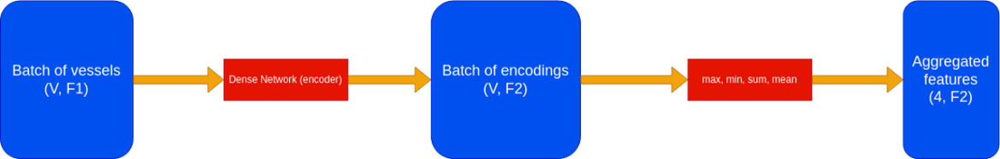

# StableBaselines3FullPipeline

This is for training and enjoying trained (or not) SB3 agents on any environment, including custom ones.

<p align="center">
  
</p>

# I - Installation

Clone the repo, create a virtual environment, and install the requirements.
```bash
git clone https://github.com/tboulet/StableBaselines3FullPipeline.git
cd StableBaselines3FullPipeline
python3 -m venv venv_sb3
source venv_sb3/bin/activate # or venv_sb3/Scripts/activate.bat on Windows
pip install -r requirements.txt
```

# II - Training agents

To quickly train an agent (for example PPO) on a certain environment (for example CartPole), run the following command:
```bash
python train_sb3.py algo=ppo env=cartpole
```
This CLI is using Hydra, allowing you to specify the different run option in a hierarchical way.

## Algorithms
For the list of usable algorithms (with argument algo=...), or if you want to add your own, see in `configs/algo`. It is really easy to add your own algorithm, just follow the PPO example.

## Environments
For the list of usable environments (with argument env=...), or if you want to add your own, see in `configs/env`. It is really easy to add your own environment, just follow the CartPole example.

## Training options
The training default config is in `configs/training/default_training`. You can modify this config or override any of its arguments using the hydra CLI. For example, to change the number of training timesteps, you can run:
```bash
python train_sb3.py algo=ppo env=cartpole training.timesteps=50000
```
I advise you to modify the `default_training` config to your needs directly rather than overriding.

Notable arguments are:
- `training.timesteps`: number of training timesteps
- `training.n_envs` : number of parallel environments
- `training.verbose` : verbosity level, from 0 (no output) to 2
- `training.do_wandb` and `training.do_tensorboard` : whether to use wandb and/or tensorboard
- `training.checkpoint` : path to a model or directory containing models to load
- `training.checkpoint_criteria` : criteria to use to load the best model from a directory (see below)

Check the `configs/training/default_training` (training) and `configs/training/default_training` (enjoy) for having more information about the arguments.

## Policy
You can also specify the policy to use for the agent using the `policy=<your policy name>` argument, such as `policy=mlp`. If you want to use a custom policy, you can add it in `configs/policy` and use it with the `policy=<your policy name>` argument.

For example you might want to use `cnn` policy for Atari games, `multi_mlp` policy for custom environments with dict observations, etc.

# III - Saving/Loading

## Saving agents
When you train an agent, models are saved every `training.eval_freq` timesteps. They are store in `training.best_model_path` and `training.final_model_path`. Their name contains the algo, env, datetime, training timesteps, and mean reward reached. Example : `models/final_model/ppo CartPole-v1 04-16_22h45min t=10000 r=171`. This name allows an easy loading of the model later and a decent understanding of the model by their name.

## Loading agents
When starting a training or enjoying an agent, a previously trained agent is loaded using the `training.checkpoint` argument.

If `training.checkpoint` is None, the model is initialized randomly. If `training.checkpoint` is a path to a model, this model is loaded. If `training.checkpoint` is a path to a directory, the best model according to the `training.checkpoint_criteria` is loaded. This criteria can either be `reward` (mean reward reached by the agent), `timesteps` (number of training timesteps) or `time` (the datetime).

# IV - Enjoying agents

For enjoying an agent, run the following command:
```bash
python enjoy_sb3.py algo=ppo env=cartpole
```
Similarly to the start of a training, this will load the best model from the `training.checkpoint` according to the `training.checkpoint_criteria` and enjoy it for `training.timesteps` timesteps.

Check the `configs/training/default_enjoy` file for more information about the arguments.

I encourage you to directly modify the enjoy.py file to your needs if your agent need to be used in a specific way.

# V - Features

## Maskable PPO

This framework adapt (by subclassing) the SB3 Maskable PPO algorithm for an easier implementation on the environment side.

For using maskable PPO on environments, you need to do those steps:
- The observation from the environment must be a dict. One of the key must be `mask` and the value must be a boolean array of size `n_actions`. This array will be used to mask the actions.
- Use a policy adapted for multi input, for example `multi_mlp` or `multi_pinn`.

Example :

```python
python train_sb3 algo=maskable_ppo env=test_env_action_masking policy=multi_mlp
```


## Permutation Invariant Neural Network

This is a policy adapted for environments where one or several observations is a set of vectors. By contrast to classical `multi_mlp` policy, the number of vectors and their order should not matter for the agent. In this case, you can specify the policy as `multi_pinn`. For example, this could represent a set of points in a 2D space or a fleet of vessel caracteristics.

<p align="center">
  
</p>

For this you need to do those steps:
- The observation from the environment must be a dict. The observations of shape (n_features,) are treated normally. The observation of shape (n_vectors_max, n_features) are treated as a set of vectors : they are first encoded vector by vector using a MLP, then we compute the mean, sum, min and max of the encoded vectors. The final observation is the concatenation of the normal observations and the encoded vectors.
- Use the `multi_pinn` policy.

Example :

```python
python train_sb3 algo=ppo env=test_env_non_constant_obs policy=multi_pinn
```